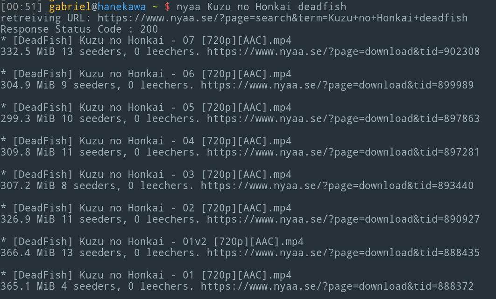

#Nyaa.hs

Command-line interface for Nyaa Torrents written in Haskell. 

## Installation

Download code from Github and install with stack. Make sure your PATH 
environment variable includes `$HOME/.local/bin`.

```
git clone https://github.com/GAumala/Nyaa.hs
cd nyaa.hs
stack install
```

## Usage

Execute `nyaa` along with any search terms as parameters.


